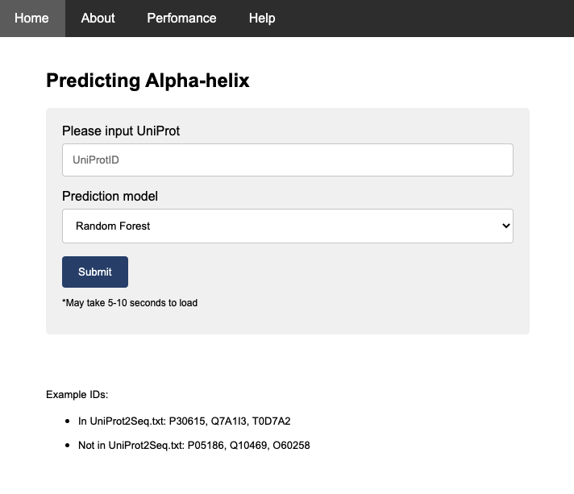
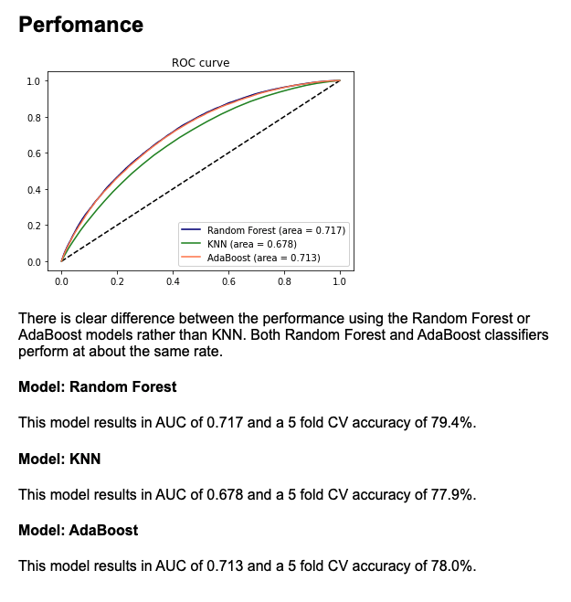

# Secondary structure formation predictor

The project includes three models trained on three separate classifers (Random Forest, KNN, and AdaBoost) to predict alpha-helices from sequence data and protein Expasy scales.

### Feature Engineering

The following features were developed from the AA Expasy scales:

Feature blurring with a window of 9 based on average value of the window ('_avg' at the end of the variable name)

Feature blurring with a window of 9 based on maximum value of the window ('_max' at the end of the variable name)

I tried normalizing the data, but at the end, it did not change the AUC so it is not included. I also experimented with the size of the window and 9 seems to work the best.

### Feature Selection

Firstly, highly correlated features (>0.8) are removed. Then, the features are selected by Recursive Feature Elimination where we start with the full model and then remove 3 at a time.

Currently, there are 20 features in the model.

## Website

The form accepts both the UniProtIDs that exist in a pre-compiled dataset using for training and testing purposes and also UniProtIDs that do not appear on that list.

On the result page, there will be a table consists of 2 columns.

Position: 1-based position indicator.
Alpha-helix: 0 means the corresponding residue locates outside alpha-helix, and vice versa.
In addition, the results page contains a button to download raw features used to predict the formation of secondary structure.

